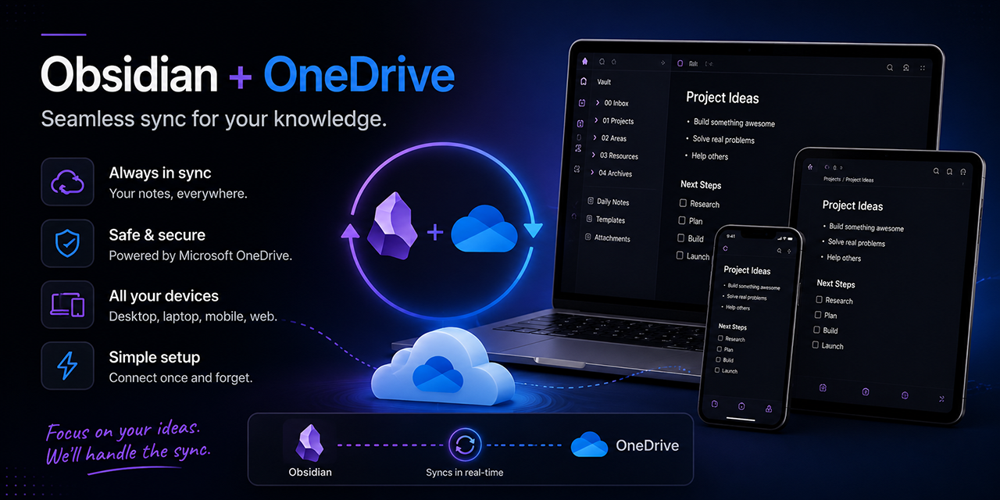

# Obsidian OneDrive Sync

Sync your Obsidian vault with **OneDrive Personal** accounts. Zero-config, mobile-friendly, battery-efficient.

📖 [How It Works](docs/HOW_IT_WORKS.md) · [Troubleshooting](docs/TROUBLESHOOTING.md) · [Development](docs/DEVELOPMENT.md)

> [!IMPORTANT]
> While I do work for Microsoft and on the OneDrive team, this plugin is in no way an official Microsoft plugin. Just a thing I needed.

## ✨ Features

- **Zero-Configuration** — No Azure AD app registration. Just click connect and authenticate.
- **Mobile-First** — Device Code Flow works on iOS and Android with no redirects.
- **Event-Driven Sync** — Syncs on file changes, not polling. Great for battery life.
- **Bidirectional** — Automatic two-way sync with configurable conflict resolution.
- **Two Access Modes** — App Folder (secure, isolated) or Full Access (shareable, flexible location).

## 🚀 Installation

### Via BRAT (Recommended)

1. Install [BRAT](https://github.com/TfTHacker/obsidian42-brat) from Community Plugins
2. BRAT settings → **Add Beta Plugin** → `JeffSteinbok/obsidian-onedrive`

### Manual

1. Download `main.js` and `manifest.json` from the [latest release](https://github.com/JeffSteinbok/obsidian-onedrive/releases)
2. Place them in `.obsidian/plugins/obsidian-onedrive/`
3. Enable the plugin in Settings → Community Plugins

## 🔧 Setup

1. Settings → OneDrive Sync → **Connect to OneDrive**
2. Enter the displayed code at [microsoft.com/devicelogin](https://microsoft.com/devicelogin)
3. Sign in and grant permissions
4. Done — your vault syncs automatically!

### Configuration

| Setting                   | Description                                                                                                                                                               |
| ------------------------- | ------------------------------------------------------------------------------------------------------------------------------------------------------------------------- |
| **Sync Interval**         | Set to 0 for manual-only sync (recommended for battery)                                                                                                                   |
| **Startup Sync Delay**    | Delay before first sync after launch (0 = disabled, 10s recommended)                                                                                                     |
| **Conflict Resolution**   | Last write wins (default), create duplicate, or manual                                                                                                                    |
| **Sync App Settings**     | Optional — sync `.obsidian/app.json`, `.obsidian/appearance.json`, and `.obsidian/hotkeys.json` to keep appearance and hotkeys consistent across devices                  |
| **Sync Plugins**          | Optional — sync plugin lists, manifests, and binaries (`main.js`, `styles.css`). Does **not** sync plugin data files (`data.json`)                                        |
| **Reset Sync Token**      | Force a full re-read from OneDrive on the next sync. Use if files appear missing or out of date                                                                           |
| **Custom Client ID**      | Optional — bring your own Azure AD app (see [GitHub docs](#custom-client-id))                                                                                             |
| **Debug Logging**         | Enable for troubleshooting                                                                                                                                                |

### Optional: `.syncIgnore`

Create a `.syncIgnore` file at your vault root to skip extra files/folders from sync (similar to `.gitignore`).

- One pattern per line
- `#` starts a comment
- `!` negation patterns are not supported
- Folder pattern example: `private/`
- Wildcard example: `*.tmp`

## 🔒 Access Modes

|                 | App Folder (Default)                                       | Full Access                                          |
| --------------- | ---------------------------------------------------------- | ---------------------------------------------------- |
| **Permissions** | Minimal — isolated app folder                              | Full OneDrive access                                 |
| **Scopes**      | `User.Read`, `Files.ReadWrite.AppFolder`, `offline_access` | `User.Read`, `Files.ReadWrite.All`, `offline_access` |
| **Location**    | `/Apps/ObsidianOneDrive/`                                  | Anywhere you choose                                  |
| **Sharing**     | No                                                         | Yes — share via OneDrive                             |
| **Browseable**  | Not easily                                                 | Yes — visible in OneDrive web/app                    |
| **Best for**    | Personal vaults, privacy-focused                           | Shared/family vaults                                 |

To switch modes: Settings → OneDrive Sync → Access Mode, then disconnect and reconnect.

## 👥 Sharing Your Vault (Full Access Mode)

1. Enable **Full Access** mode and set your sync folder path (e.g., `/Documents/MyVault`)
2. In OneDrive web/app, share that folder with others ("Can edit")
3. **They don't need the plugin!** They just use OneDrive's native sync:
   - **Desktop**: Accept the share → OneDrive syncs locally → open folder as vault in Obsidian
   - **Mobile**: Accept the share → "Make available offline" in OneDrive app → open as vault

**Tip**: Use "Create duplicate" conflict resolution to avoid overwriting each other's changes.

## 📱 Mobile Support

This plugin is designed with mobile as a **primary target**:

- **Device Code Flow** — no custom URL schemes or redirects needed
- **Event-Driven Sync** — only syncs when files change (battery-efficient)
- **iOS**: Use Safari to complete authentication
- **Android**: Use Chrome or your default browser

## Custom Client ID

By default the plugin uses a shared Azure AD app registration. For privacy or rate-limit reasons you can bring your own:

1. Go to [Azure Portal](https://portal.azure.com) → Microsoft Entra ID → App registrations
2. Click **New registration**
3. Name: `Obsidian OneDrive Sync` (or anything you like)
4. Supported account types: **Personal Microsoft accounts only**
5. Redirect URI: Leave blank (not needed for device code flow)
6. After registration, copy the **Application (client) ID**
7. Under **Authentication** → enable **Allow public client flows**

Then paste the client ID into Settings → OneDrive Sync → Advanced → Custom client ID.
